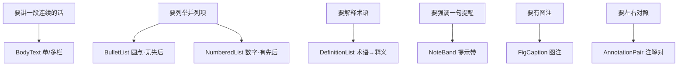

# 组件分类体系 · Taxonomy（14 族 / 71 个组件）

> **本文件是"选组件"的唯一入口。** 装配一页时，不要凭记忆猜组件名，先按下面的"层"定位，
> 再进 `components.md` 查签名。分类轴是 **层（layer）= 这一页要说什么** × **族（family）= 用哪种形态说**。

## 为什么按"层"分，而不是按文件分

`components.md` 按**族**（源文件）组织——那是"作者视角"，便于查签名。
但设计一页时的真实顺序是**自上而下**：先定这页要说哪一层的事（标题？参数？证据？），再选形态。
两套索引不冲突：**层是动词（我要说什么），族是名词（用什么装）。**

## 六个层与对应族

| 层 | 这一层回答什么 | 对应族 | 组件数 | 一页允许几个 |
|---|---|---|---|---|
| **1 骨架** | 这是什么页（封面 / 章节 / 内页 / 封底） | A 结构页、G 页面骨架 | 8 | 页级唯一 |
| **2 标题** | 这页/这节讲什么 | B 标题族 | 12 | H1 一页一个，H2 可多个 |
| **3 文本** | 怎么把话讲清楚 | K 文本族 | 7 | 不限 |
| **4 结构化信息** | 参数、承诺、选型、目录 | C 表格族、D 卡片族 | 13 | 每页 1–2 组 |
| **5 图形** | 流程、关系、数据、图解 | E 流程、F 案例、H 流程图解、**M 拓扑**、I 数据、N 图解 | 26 | 每页 1–2 个 |
| **6 页眉页脚** | 品牌条与联系带 | O 页眉页脚 | 2 | 每页 ≤1 |
| （辅助） | 标签与图标列表 | J 标签族 | 3 | 不限 |
| （原语） | 图标、装饰、页码 | G（`Icon` / `CapsuleDecor` / `Folio`） | 计入上层 | — |

> **装配心法**：一次只问一个问题——"读者现在需要的是**承诺**（卡片）、**证据**（表/图）还是**路径**（流程/拓扑）？"
> 这三者的配比，就是这一页的密度曲线。

---

## 层 2 · 标题：12 种形态的**语义**分工

这是最容易被滥用的层——形态好看就到处用，结果一份手册出现 5 种页题。**形态必须跟语义绑定。**

| 形态 | 组件 | 语义 | 级别 | 视觉特征 |
|---|---|---|---|---|
| 眉标 | `EyebrowTitle` | 章节归属（"第 3 章 · 检测服务"） | 眉 | 小字 + 短色条 |
| 中英对照 | `PairTitle` | **服务型手册主力**：中文实标题 + 英文副题 | H1 | 大中文 + 小浅英文 |
| 实底胶囊 | `PillTitle` | 强承诺页题（原创自 GenScript） | H1 | stadium 实底白字居中 |
| 方块实底 | `BlockTitle` | 硬朗、技术感页题 | H1 | 直角实底白字左对齐 |
| 描边空心 | `OutlineTitle` | 轻量化页题（内容页负担小的场合） | H1 | 描边 + 主色字 |
| 左色条 | `BarTitle` | 小节标题（同一页内的第 2、3 组） | H2 | 左粗色条 + 黑字 |
| 细线夹 | `RuleTitle` | 小节标题（最轻、最"期刊"） | H2 | 上下细线夹字 |
| 编号 | `NumberedTitle` | 有序章节（"01 分析开发"） | H1 | 大号数字 + 标题 |

**纪律**
- **H1 一页一个**；H2 可多个且**全册只用一种**（要么都 `BarTitle`，要么都 `RuleTitle`）。
- 中英对照是**服务型手册**的默认页题；产品型手册可用 `BlockTitle`。
- 形态混用上限：**一份手册 ≤2 种 H1 形态**（如封面后统一 `PairTitle`，章节页用 `BlockTitle`）。

---

## 层 3 · 文本：7 个组件覆盖全部叙述需求



**唯一允许的高亮手段是行内加粗**（`**x**` → `renderRich`）：不加色、不加底、不加下划线。
这是 MCE 五册全稿验证过的规则——彩色高亮会让"证据型文档"变成"营销海报"。

---

## 层 4 · 表格 6 种 + 卡片 7 种

### 表格：先判**语体**，再选组件（R16）

| 语体 | 用在哪 | 组件 |
|---|---|---|
| **营销参数表**（实底反白表头） | 卖点、档位、承诺数字 | `SpecTable`、`TierMatrixTable` |
| **技术数据表**（浅底细线表头） | 检测数据、方法学、仪器报告 | `InstrumentReportPanel` |
| **矩阵表**（行标签在左，列=产品） | 多产品 × 多维度对照 | `RowLabelMatrixTable` |
| **方法表**（中文名 + 英文缩写分行） | 方法学清单 | `MethodTable` |
| **键值表**（无表头两列） | 属性→取值清单 | `KeyValueTable` |
| 通栏合并头行 | 大表内分产品段 | `ProductHeaderRow` |

**六种表一律无竖线**（R5）。`TierMatrixTable` 用列头深浅表达承诺强度。

### 卡片

| 组件 | 语义 |
|---|---|
| `StatCardRow` | 一行 3–4 张等宽卖点卡 |
| `TierCards` | 三档套餐（周期 + 价格） |
| `ProductCardGrid` | 产品/服务卡网格（**类目条默认同色相**，见 R22） |
| `MetricStrip` | 大数字指标条（细上下线夹，无框） |
| `TocList` | 目录条目（点线引导） |
| `TestimonialCard` | 客户证言 |
| `ConclusionBanner` | 通栏结论横幅 / CTA |

---

## 层 5 · 图形：**语义决定拓扑**（R14 的组织方式）

这一层组件最多（26 个），也最容易选错。判据只有一条：**你要表达的是哪种关系？**

| 你要表达 | 组件 | 拓扑 | 判断特征 |
|---|---|---|---|
| 分几步、有先后 | `NumberedStepFlow` | 编号步骤流 | 圆编号 01–06 骑在盒顶 |
| 分几步、数据收敛 | `FunnelStages` | 漏斗 | 逐层收窄 + 量化数字 |
| A 且 B 且 C（无先后） | `HexChain` | 六边形相加链 | 用 `⊕` 而非 `›` |
| 我们是怎么做的 | `BeadChain` | 实验动作链 | 带质感圆珠 |
| 完整服务管线 | `StagePipelineChain` | 圆节点链 | 总图首选，配 spectrum |
| 迭代、回到起点 | `AnnotatedCycle` | 标注环 | 弧箭头顺时针 + 中心标签 |
| 组合成产物（A＋B»C） | `ComboEquationDiagram` | 公式图 | 三栏公式 |
| 有多入口汇聚再分出 | `ServiceNetworkMap` | **网络图** | 网格落位 + 中枢独跨整行 |
| 处在时间轴哪一段 | `PhaseBand` | 阶段带 | 多段色带 + 归档 + active |
| 简单列个先后（轻量） | `FlowChain` / `ChevronFlow` / `IconFlowBar` / `TimelineBar` | 链 / 燕尾 / 图标条 / 时间轴 | 族 E 底座 |

**铁律**：同一份手册里，**同一种语义永远用同一种拓扑**；**不同语义绝不共用同一种拓扑**。
把"迭代"画成链、把"并列"画成流程，是读者最容易察觉的廉价感来源。

### 图表（族 I）

| 组件 | 语义 |
|---|---|
| `TargetBarChart` | 单序列排行（**替代饼图**） |
| `PanelBarChart` | 小倍数多面板（共享刻度才可比） |
| `AnnotatedDonut` | 构成 + 逐块注解（注解块标题色 = 扇区色） |
| `ScatterClusterPanel` | 分布形态（聚类 / 离散） |
| `InstrumentReportPanel` | 图 + 数据表同框（技术语体） |
| `CitationBlock` | 文献引用（替代 logo 墙） |

### 图解与证据（族 F / N）

`FigurePanel`（统一外壳）/ `LegendFigure`（三栏图例网格）/ `SwatchLegend`（色卡图例）
`CaseBlock`（案例三段式）/ `EvidenceGrid`（原始实验图）/ `DataChart`（双系列柱状图）

---

## 色彩纪律：`palette` 参数怎么选（R22）

任何要"多档颜色"的组件（`HexChain` / `ProductCardGrid` / `NumberedStepFlow` / `BeadChain` / `AnnotatedDonut` / `ScatterClusterPanel` / `LegendFigure`）
都有 `palette` 参数：

| 取值 | 效果 | 什么时候用 |
|---|---|---|
| `palette="tone"`（**默认**） | 同一色相多档明度（`toneRamp`） | **99% 的场合**。并列的条目之间没有语义差异，只是"第一条、第二条" |
| `palette="category"` | 跨色相（`categoryRamp`） | 条目**本身就是不同的类目**，且该类目色在全册保持一致（R21） |

**为什么默认是 `tone`**：跨色相会让读者以为颜色有含义。当颜色**没有**含义时，用同色相多档——
版面立刻从"花"变"稳"。这是 R1「一册一色相」在**组件级别**的落点。

> 派生函数：`toneRamp(baseHex, n)` / `categoryRamp(baseHex, n)`。
> 旧签名 `pastelRamp(baseHex, n)` 默认跨色相（兼容 v0.3），**新代码请用这两个语义化别名**。

---

## 一页的装配顺序（把层串起来）

```jsx
<Page number={4} folioSide="right">
  <EyebrowTitle>第 3 章 · 检测服务</EyebrowTitle>          {/* 层 2 眉标 */}
  <PairTitle cn="质粒与病毒载体质控" en="Plasmid & vector QC" />  {/* 层 2 页题 */}
  <BodyText>…</BodyText>                                    {/* 层 3 叙述 */}
  <KeyValueTable items={[…]} />                             {/* 层 4 结构化 */}
  <MetricStrip items={[…]} />                               {/* 层 4 指标 */}
  <NumberedStepFlow steps={[…]} />                          {/* 层 5 拓扑 */}
  <PanelBarChart panels={[…]} />                            {/* 层 5 图表 */}
  <ContactFooterBand contacts={[…]} />                      {/* 层 6 页脚 */}
</Page>
```

**层序不是必须全用**——但**顺序不能乱**：标题 → 叙述 → 结构化 → 图形 → 页脚。
把图放在标题之前、或把两张表夹在段落中间，都会让页面失去"可扫读"的节奏。
